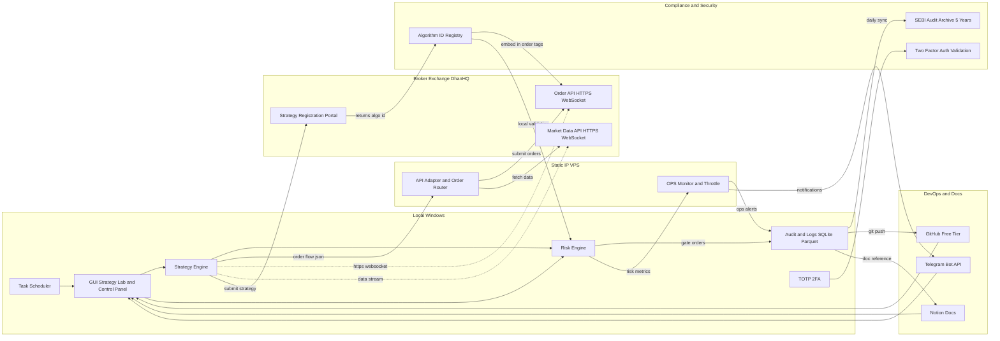

# T18 Connectivity Map (Concept-Only)

```mermaid
flowchart LR
  %% -------------------- SWIMLANES --------------------
  subgraph L1 [Local Windows]
    direction TB
    A3[GUI Strategy Lab and Control Panel]
    A1[Strategy Engine]
    A2[Risk Engine]
    A4[Audit and Logs SQLite Parquet]
    A5[Task Scheduler]
    A6[TOTP 2FA]
  end

  subgraph L2 [Static IP VPS]
    direction TB
    V1[API Adapter and Order Router]
    V2[OPS Monitor and Throttle]
  end

  subgraph L3 [Broker Exchange DhanHQ]
    direction TB
    B1[Market Data API HTTPS WebSocket]
    B2[Order API HTTPS WebSocket]
    B3[Strategy Registration Portal]
  end

  subgraph L4 [Compliance and Security]
    direction TB
    C1[Algorithm ID Registry]
    C2[SEBI Audit Archive 5 Years]
    C3[Two Factor Auth Validation]
  end

  subgraph L5 [DevOps and Docs]
    direction TB
    D1[GitHub Free Tier]
    D2[Notion Docs]
    D3[Telegram Bot API]
  end

  %% -------------------- INTRA LANE FLOWS --------------------
  %% Local processing loop
  A3 --> A1
  A3 --> A2
  A1 --> A2
  A2 -->|gate orders| A4
  A6 --> C3
  A5 --> A3

  %% VPS ops
  V2 -->|ops alerts| A4

  %% -------------------- CROSS LANE FLOWS --------------------
  %% Orders and data via VPS
  A1 -->|order flow json| V1
  A2 -->|risk metrics| V2
  V1 -->|submit orders| B2
  V1 -->|fetch data| B1

  %% Direct local option to broker
  A1 -.->|https websocket| B2
  A1 -.->|data stream| B1

  %% Compliance path
  A1 -->|submit strategy| B3
  B3 -->|returns algo id| C1
  C1 -->|embed in order tags| B2
  C1 -->|local validation| A2
  A4 -->|daily sync| C2

  %% DevOps and documentation
  A4 -->|git push| D1
  A4 -->|doc reference| D2
  V2 -->|notifications| D3
  D1 --> A3
  D2 --> A3
  D3 --> A3

```