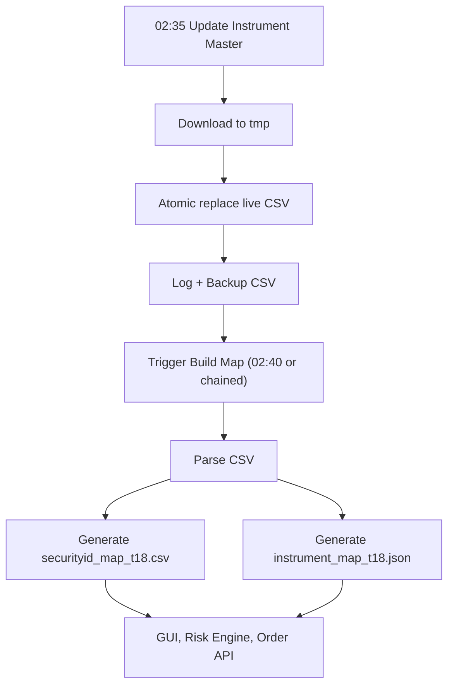
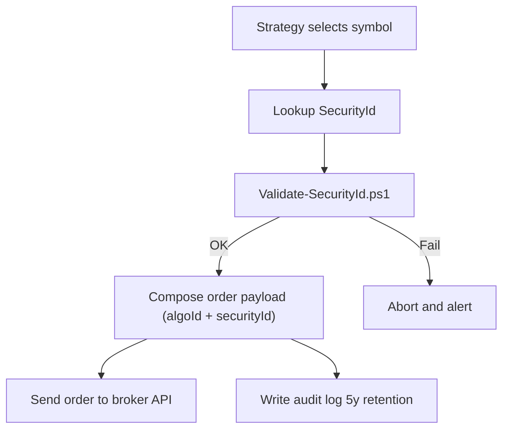

# T18 — Automate Dhan instrument master refresh AutoSync Implementation (Windows, SEBI-Aligned)

`C:\T18\docs\DOCUMENTATION\AutoSync Implementation.md`

---

**Owner:** TEEVRA18 (T18)

**Repo:** `C:\T18` (remote: `https://github.com/nkd3/t18`)

**Scope:** Automate **Dhan instrument master** refresh → generate **SecurityId maps** → feed **T18 GUI / order pipeline** with verifiable, up-to-date IDs.

**Compliance:** SEBI-aligned (algoId tagging, 5-year audit artifacts, 2FA/static-IP handled at platform level).

**OS:** Windows 10/11 (PowerShell 5.1+).

**Single Source of Truth:** `C:\T18`

---

## 0) Document Map

- [1) Goals & Rationale](https://chatgpt.com/g/g-p-68e27435e2708191b94f807f4e0e9798-teevra18/c/68e8c844-760c-8332-a679-e850e1ec5aff#1-goals--rationale)
- [2) Architecture Overview](https://chatgpt.com/g/g-p-68e27435e2708191b94f807f4e0e9798-teevra18/c/68e8c844-760c-8332-a679-e850e1ec5aff#2-architecture-overview)
- [3) Folder & File Layout](https://chatgpt.com/g/g-p-68e27435e2708191b94f807f4e0e9798-teevra18/c/68e8c844-760c-8332-a679-e850e1ec5aff#3-folder--file-layout)
- [4) Environment Bootstrap (Profile)](https://chatgpt.com/g/g-p-68e27435e2708191b94f807f4e0e9798-teevra18/c/68e8c844-760c-8332-a679-e850e1ec5aff#4-environment-bootstrap-profile)
- [5) Core Scripts](https://chatgpt.com/g/g-p-68e27435e2708191b94f807f4e0e9798-teevra18/c/68e8c844-760c-8332-a679-e850e1ec5aff#5-core-scripts)
    - [5.1 Update-InstrumentMaster.ps1](https://chatgpt.com/g/g-p-68e27435e2708191b94f807f4e0e9798-teevra18/c/68e8c844-760c-8332-a679-e850e1ec5aff#51-update-instrumentmasterps1)
    - [5.2 Build-InstrumentMap.ps1](https://chatgpt.com/g/g-p-68e27435e2708191b94f807f4e0e9798-teevra18/c/68e8c844-760c-8332-a679-e850e1ec5aff#52-build-instrumentmapps1)
    - [5.3 Optional Utilities](https://chatgpt.com/g/g-p-68e27435e2708191b94f807f4e0e9798-teevra18/c/68e8c844-760c-8332-a679-e850e1ec5aff#53-optional-utilities)
- [6) Scheduling (schtasks)](https://chatgpt.com/g/g-p-68e27435e2708191b94f807f4e0e9798-teevra18/c/68e8c844-760c-8332-a679-e850e1ec5aff#6-scheduling-schtasks)
- [7) Order Preflight & Usage](https://chatgpt.com/g/g-p-68e27435e2708191b94f807f4e0e9798-teevra18/c/68e8c844-760c-8332-a679-e850e1ec5aff#7-order-preflight--usage)
- [8) Compliance Controls](https://chatgpt.com/g/g-p-68e27435e2708191b94f807f4e0e9798-teevra18/c/68e8c844-760c-8332-a679-e850e1ec5aff#8-compliance-controls)
- [9) Operations Runbook](https://chatgpt.com/g/g-p-68e27435e2708191b94f807f4e0e9798-teevra18/c/68e8c844-760c-8332-a679-e850e1ec5aff#9-operations-runbook)
- [10) Mermaid Workflows](https://chatgpt.com/g/g-p-68e27435e2708191b94f807f4e0e9798-teevra18/c/68e8c844-760c-8332-a679-e850e1ec5aff#10-mermaid-workflows)
- [11) Troubleshooting](https://chatgpt.com/g/g-p-68e27435e2708191b94f807f4e0e9798-teevra18/c/68e8c844-760c-8332-a679-e850e1ec5aff#11-troubleshooting)
- [12) Change Log](https://chatgpt.com/g/g-p-68e27435e2708191b94f807f4e0e9798-teevra18/c/68e8c844-760c-8332-a679-e850e1ec5aff#12-change-log)

---

## 1) Goals & Rationale

- **Consistency:** Keep all data/scripts under `C:\T18` as the single source of truth (SSOT) for Dev & Ops.
- **Reliability:** Daily refresh of Dhan instrument master with **atomic writes**, **retry**, **rollback**.
- **Determinism:** Generate curated **CSV/JSON** maps for `SecurityId` lookup used by GUI & order modules.
- **Compliance:** Maintain **5-year** audit trail (logs, backups, version history); tag all orders with **algoId + securityId**.

---

## 2) Architecture Overview

- **Input:** Dhan instrument master CSV (`api-scrip-master.csv`).
- **Processing:**
    1. **Refresh task** downloads and atomically replaces CSV; logs and backups.
    2. **Build task** parses CSV → outputs `securityid_map_t18.csv` and `instrument_map_t18.json`.
- **Output:** Mapping files consumed by T18 UI, Risk Engine, and Order API layer.

**Runtime host:** Windows PowerShell 5.1 (explicitly pinned for module compatibility).

---

## 3) Folder & File Layout

```
C:\T18
├─ data
│  ├─ api-scrip-master.csv                       # latest master
│  ├─ api-scrip-master_YYYYMMDD_HHMMSS.csv       # backups
│  ├─ securityid_map_t18.csv                     # curated CSV map
│  ├─ instrument_map_t18.json                    # curated JSON map
│  └─ logs
│     └─ update_instrument_master.log            # run logs (append-only)
├─ scripts
│  ├─ Update-InstrumentMaster.ps1
│  ├─ Build-InstrumentMap.ps1
│  ├─ Validate-SecurityId.ps1                    # optional preflight
│  └─ (future scripts...)
└─ docs
   └─ DOCUMENTATION
      └─ AutoSync Implementation.md              # this document

```

---

## 4) Environment Bootstrap (Profile)

**Purpose:** Set `$env:T18Root`, ensure folders exist, and load a helpful `Get-SecurityId` lookup.

> Open profile: notepad $PROFILE and paste the snippet below.
> 

```powershell
# T18 PowerShell Profile (Windows-only)
$env:T18Root = "C:\T18"
Set-Location $env:T18Root

$env:T18Data   = Join-Path $env:T18Root "data"
$env:T18Docs   = Join-Path $env:T18Root "docs"
$env:T18Script = Join-Path $env:T18Root "scripts"
foreach ($f in @($env:T18Data,$env:T18Docs,$env:T18Script)) {
  if (-not (Test-Path $f)) { New-Item -Path $f -ItemType Directory -Force | Out-Null }
}

function Get-SecurityId {
  [CmdletBinding()]
  param(
    [Parameter(Mandatory)][string]$Symbol,
    [string]$Segment, [string]$InstrType, [string]$Series,
    [string]$OptionType, [double]$Strike, [datetime]$Expiry,
    [ValidateSet('NSE_EQ','BSE_EQ','IDX_UNDERLYING','ANY')] [string]$Preset = 'ANY'
  )
  $path = Join-Path $env:T18Data "api-scrip-master.csv"
  if (-not (Test-Path $path)) { Write-Warning "Missing $path"; return }
  $csv = Import-Csv $path
  $q = $csv | ? { $_.SEM_TRADING_SYMBOL -eq $Symbol }
  switch ($Preset) {
    'NSE_EQ'        { $q = $q | ? { $_.SEM_SEGMENT -eq 'E' -and $_.SEM_SERIES -eq 'EQ' } }
    'BSE_EQ'        { $q = $q | ? { $_.SEM_SEGMENT -eq 'E' -and $_.SEM_SERIES -eq 'A' } }
    'IDX_UNDERLYING'{ $q = $q | ? { $_.SEM_SEGMENT -eq 'I' -and $_.SEM_EXCH_INSTRUMENT_TYPE -eq 'INDEX' } }
  }
  if ($Segment)   { $q = $q | ? { $_.SEM_SEGMENT -eq $Segment } }
  if ($InstrType) { $q = $q | ? { $_.SEM_EXCH_INSTRUMENT_TYPE -eq $InstrType } }
  if ($Series)    { $q = $q | ? { $_.SEM_SERIES -eq $Series } }
  if ($OptionType){ $q = $q | ? { $_.SEM_OPTION_TYPE -eq $OptionType } }
  if ($Strike)    { $q = $q | ? { [double]$_.SEM_STRIKE_PRICE -eq $Strike } }
  if ($Expiry)    { $q = $q | ? { (Get-Date $_.SEM_EXPIRY_DATE).Date -eq $Expiry.Date } }
  $q | select @{n='TradingSymbol';e={$_.SEM_TRADING_SYMBOL}},
              @{n='SecurityId';e={$_.SEM_SMST_SECURITY_ID}},
              @{n='Segment';e={$_.SEM_SEGMENT}},
              @{n='InstrType';e={$_.SEM_EXCH_INSTRUMENT_TYPE}},
              @{n='Series';e={$_.SEM_SERIES}},
              SEM_OPTION_TYPE, SEM_STRIKE_PRICE, SEM_EXPIRY_DATE |
      sort Segment, InstrType, SEM_EXPIRY_DATE, SEM_STRIKE_PRICE |
      ft -AutoSize
}

Write-Host "[TEEVRA18 Environment Loaded]" -ForegroundColor Cyan
Write-Host "Root: $env:T18Root"

```

> Execution policy (per-user)
> 

```powershell
Set-ExecutionPolicy -Scope CurrentUser -ExecutionPolicy RemoteSigned -Force
. $PROFILE

```

---

## 5) Core Scripts

### 5.1 `Update-InstrumentMaster.ps1`

- Downloads the Dhan CSV to a **tmp** file and **atomically** replaces the live file.
- **Retries** with backoff; **rollback** to last good backup if all retries fail.
- Appends to a **continuous log** and **optionally triggers** the map build task.

```powershell
# C:\T18\scripts\Update-InstrumentMaster.ps1
$ProgressPreference = 'SilentlyContinue'
$root = $env:T18Root; if (-not $root) { $root = 'C:\T18' }
$data = Join-Path $root 'data'
$log  = Join-Path $data 'logs'

$uri  = 'https://images.dhan.co/api-data/api-scrip-master.csv'
$dst  = Join-Path $data 'api-scrip-master.csv'
$tmp  = Join-Path $data 'api-scrip-master.tmp'
$bak  = Join-Path $data ("api-scrip-master_{0:yyyyMMdd_HHmmss}.csv" -f (Get-Date))

New-Item -Force -Type Directory $data,$log | Out-Null
if (Test-Path $dst) { Copy-Item $dst $bak -Force }

$max = 5; $ok = $false
for ($i=1; $i -le $max -and -not $ok; $i++) {
  try {
    Invoke-WebRequest -Uri $uri -OutFile $tmp -UseBasicParsing -TimeoutSec 60
    Move-Item $tmp $dst -Force
    "`tOK  $(Get-Date -Format s)  updated $dst" |
      Tee-Object -FilePath (Join-Path $log 'update_instrument_master.log') -Append
    $ok = $true
  } catch {
    "`tERR $(Get-Date -Format s)  $($_.Exception.Message)" |
      Tee-Object -FilePath (Join-Path $log 'update_instrument_master.log') -Append
    Start-Sleep -Seconds (3 * $i)
  }
}

if (-not $ok -and (Test-Path $bak)) {
  Copy-Item $bak $dst -Force
  "`tROLLBACK $(Get-Date -Format s)  restored $dst from backup" |
    Tee-Object -FilePath (Join-Path $log 'update_instrument_master.log') -Append
  exit 1
}

if ($ok) {
  Start-Sleep -Seconds 5
  schtasks /Run /TN "T18_BuildInstrumentMap" | Out-Null
}

```

---

### 5.2 `Build-InstrumentMap.ps1`

- Parses the refreshed CSV and emits **curated maps** (CSV + JSON).
- Universe defaults: `NIFTY`, `BANKNIFTY`, `RELIANCE`, `INFY` (edit anytime).

```powershell
# C:\T18\scripts\Build-InstrumentMap.ps1
$root = $env:T18Root; if (-not $root) { $root = 'C:\T18' }
$data = Join-Path $root 'data'
$src  = Join-Path $data 'api-scrip-master.csv'

# Defensive import with backoff (in case update is mid-swap)
for ($i=1; $i -le 5; $i++) {
  try { $csv = Import-Csv $src; break } catch { Start-Sleep -Seconds (2*$i) }
}

$Universe = @('NIFTY','BANKNIFTY','RELIANCE','INFY')

$map = $csv | Where-Object { $_.SEM_TRADING_SYMBOL -in $Universe -and $_.SEM_SEGMENT -in 'I','E' } |
  Select-Object @{n='TradingSymbol';e={$_.SEM_TRADING_SYMBOL}},
                 @{n='SecurityId';e={$_.SEM_SMST_SECURITY_ID}},
                 @{n='Segment';e={$_.SEM_SEGMENT}},
                 @{n='InstrType';e={$_.SEM_EXCH_INSTRUMENT_TYPE}},
                 @{n='Series';e={$_.SEM_SERIES}},
                 SEM_OPTION_TYPE, SEM_STRIKE_PRICE, SEM_EXPIRY_DATE |
  Sort-Object TradingSymbol, Segment, InstrType, SEM_EXPIRY_DATE, SEM_STRIKE_PRICE

$map | Export-Csv -NoTypeInformation -Encoding UTF8 (Join-Path $data 'securityid_map_t18.csv')
$map | ConvertTo-Json | Out-File -Encoding UTF8 (Join-Path $data 'instrument_map_t18.json')

Write-Host "Instrument maps updated in $data"

```

---

### 5.3 Optional Utilities

**Validate-SecurityId.ps1** — preflight guard before orders:

```powershell
# C:\T18\scripts\Validate-SecurityId.ps1
param(
  [Parameter(Mandatory)][string]$TradingSymbol,
  [Parameter(Mandatory)][int]$SecurityId
)
$src = Join-Path ($env:T18Root ?? 'C:\T18') 'data\api-scrip-master.csv'
$hit = Import-Csv $src | ? { $_.SEM_TRADING_SYMBOL -eq $TradingSymbol -and [int]$_.SEM_SMST_SECURITY_ID -eq $SecurityId }
if ($hit) { Write-Host "OK $TradingSymbol -> $SecurityId" -ForegroundColor Green; exit 0 }
Write-Error "Mismatch or unknown SecurityId for $TradingSymbol -> $SecurityId"; exit 1

```

---

## 6) Scheduling (schtasks)

**Pin to Windows PowerShell 5.1** and avoid PS 7 CIM issues.

```powershell
# Update task @ 02:35 (daily)
$psx = "$env:SystemRoot\System32\WindowsPowerShell\v1.0\powershell.exe"
$tr1 = "$psx -NoProfile -ExecutionPolicy Bypass -File `"C:\T18\scripts\Update-InstrumentMaster.ps1`""
schtasks /Delete /TN "T18_UpdateInstrumentMaster" /F 2>$null
schtasks /Create /TN "T18_UpdateInstrumentMaster" /SC DAILY /ST 02:35 /TR "$tr1" /F

# Build task @ 02:40 (daily) — optional if you keep chain trigger in update script
$tr2 = "$psx -NoProfile -ExecutionPolicy Bypass -File `"C:\T18\scripts\Build-InstrumentMap.ps1`""
schtasks /Delete /TN "T18_BuildInstrumentMap" /F 2>$null
schtasks /Create /TN "T18_BuildInstrumentMap" /SC DAILY /ST 02:40 /TR "$tr2" /F

```

**Run now & verify**

```powershell
schtasks /Run /TN "T18_UpdateInstrumentMaster"
schtasks /Run /TN "T18_BuildInstrumentMap"
schtasks /Query /TN "T18_UpdateInstrumentMaster" /V /FO LIST | findstr /C:"Task To Run" /C:"Last Result"
schtasks /Query /TN "T18_BuildInstrumentMap"    /V /FO LIST | findstr /C:"Task To Run" /C:"Last Result"

```

---

## 7) Order Preflight & Usage

- Use **Get-SecurityId** or the generated maps to obtain the correct `SecurityId`.
- Validate before placing orders:

```powershell
powershell -File C:\T18\scripts\Validate-SecurityId.ps1 -TradingSymbol NIFTY -SecurityId 13

```

- Minimal payload shape for downstream API layer:

```json
{
  "algoId": "T18_0001",
  "securityId": 13,
  "side": "BUY",
  "orderType": "MARKET",
  "quantity": 50
}

```

---

## 8) Compliance Controls

- **SEBI auditability:**
    - Orders **must** include `algoId` and `securityId`.
    - Persist logs (`update_instrument_master.log`) and **backups** of the master CSV.
    - Retain artifacts (CSV, JSON, logs) in `C:\T18\data` for **≥ 5 years**.
- **Change control:** Commit generated maps and script updates to Git for version history.
- **Static IP / 2FA:** Enforced at broker/network layer per platform setup (out of scope for this module).
- **GUI configuration:** No manual file edits by end-users; all toggles via GUI (future step).

---

## 9) Operations Runbook

- **Daily (auto):**
    - 02:35 → `T18_UpdateInstrumentMaster` refreshes CSV.
    - 02:40 → `T18_BuildInstrumentMap` generates maps (or chain-triggered).
- **Manual run:**
    
    ```powershell
    powershell -File C:\T18\scripts\Update-InstrumentMaster.ps1
    powershell -File C:\T18\scripts\Build-InstrumentMap.ps1
    
    ```
    
- **Quick inspect:**
    
    ```powershell
    Get-Content C:\T18\data\logs\update_instrument_master.log -Tail 20
    Get-ChildItem C:\T18\data | Sort LastWriteTime -Desc | Select -First 5 Name,LastWriteTime,Length
    
    ```
    
- **Common lookups:**
    
    ```powershell
    . $PROFILE
    Get-SecurityId -Symbol "NIFTY" -Preset IDX_UNDERLYING    # expect 13
    Get-SecurityId -Symbol "BANKNIFTY" -Preset IDX_UNDERLYING # expect 25
    Get-SecurityId -Symbol "RELIANCE" -Preset NSE_EQ          # e.g., 2885
    
    ```
    

---

## 10) Mermaid Workflows

**A) End-to-End AutoSync**



**B) Preflight Validation**



---

## 11) Troubleshooting

- **Task “Invalid class” when using `New-ScheduledTaskAction`:**
    
    Use `schtasks.exe` instead (compatible across PS 5.1 and 7+).
    
- **“The process cannot access the file … in use”:**
    
    This happens if build starts during update. Fix by staggering to `02:45` or keep the **chain trigger** in `Update-InstrumentMaster.ps1`.
    
- **Profile function missing:**
    
    Ensure `Set-ExecutionPolicy -Scope CurrentUser RemoteSigned` and reload via `. $PROFILE`.
    
- **Last Result 267009:**
    
    Task is still **Running/Queued**. Check again after completion; success is **0**.
    

---

## 12) Change Log

- **2025-10-14**
    - Consolidated SSOT → `C:\T18`.
    - Implemented daily refresh with **atomic move**, **retry**, **rollback**.
    - Added build step to output **CSV + JSON** maps.
    - Scheduled with **schtasks** (02:35, 02:40) and provided chain trigger.
    - Profile bootstrap + `Get-SecurityId` utility.
    - SEBI audit artifacts under `C:\T18\data` with 5-year retention guidance.

---

**Status:** ✅ **Operational / Production-Ready**

**Next:** Wire these maps into the T18 GUI dropdowns and order composer so users never type `SecurityId` manually.
