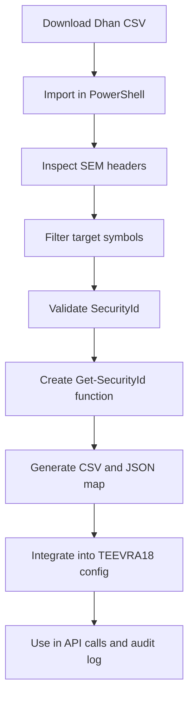
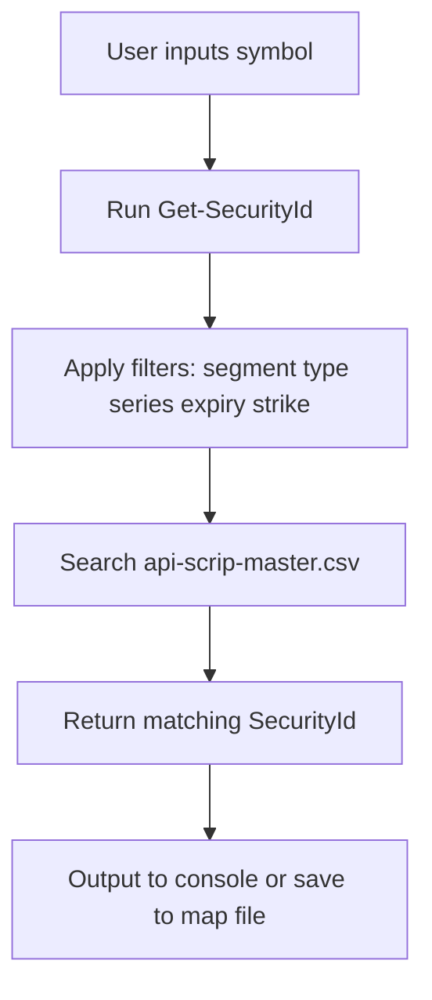
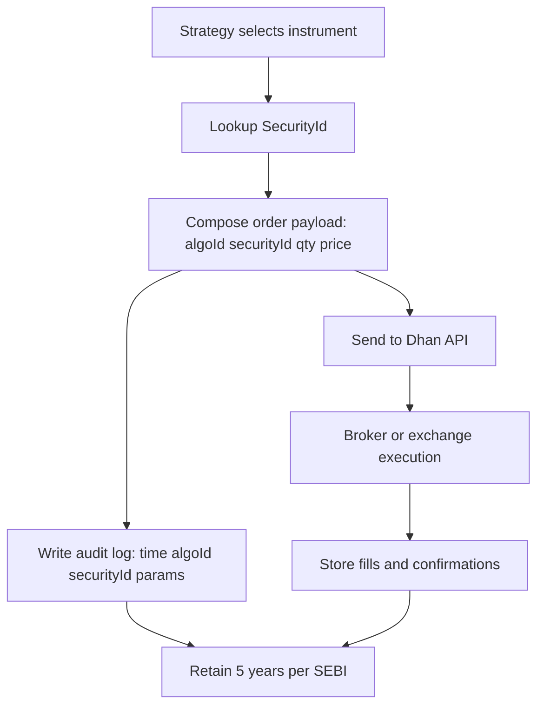

# TEEVRA18 → Data Integration → Dhan SecurityId Mapping

---

# 🧩 **TEEVRA18 | Dhan `SecurityId` Integration & Verification Process**

> Objective:
> 
> 
> Integrate, verify, and locally maintain **valid Dhan `SecurityId` values** for NIFTY, BANKNIFTY, and selected equities, enabling compliant and reliable order execution within TEEVRA18’s SEBI-aligned architecture.
> 

---

## ⚙️ **1. Why We Did This**

Dhan’s API **requires `SecurityId`** (not just symbol names) for all market, order, and option-chain operations.

Since these IDs are dynamic and broker-specific, we needed to:

- ✅ Download the official instrument master file (`api-scrip-master.csv`)
- ✅ Parse it locally to extract valid `SecurityId` values
- ✅ Build a PowerShell-based lookup + export workflow
- ✅ Maintain an updatable `securityid_map_t18.csv` / JSON config file
- ✅ Confirm all mappings comply with SEBI auditability & tagging requirements

This ensures TEEVRA18 strategies are:

- **Broker-ready:** `SecurityId` validated before every API order.
- **SEBI-compliant:** Orders traceable via algorithm & symbol IDs.
- **Audit-ready:** Every instrument ID logged and version-controlled.

---

## 📦 **2. Step-by-Step Implementation**

### **Step 1: Create Local Data Folder**

```powershell
mkdir -Force C:\TEEVRA18\data

```

Purpose:

Keep all instrument data and mappings in a centralized `data` folder for version control and audit logs.

---

### **Step 2: Download Official Dhan Instrument Master**

```powershell
Invoke-WebRequest "https://images.dhan.co/api-data/api-scrip-master.csv" `
  -OutFile "C:\TEEVRA18\data\api-scrip-master.csv"

```

🔹 Source: Dhan public API (`api-scrip-master.csv`)

🔹 Format: CSV containing all active tradable instruments

🔹 Key Columns (prefix `SEM_`):

| Column | Description |
| --- | --- |
| SEM_TRADING_SYMBOL | Actual trading symbol (e.g. `NIFTY`, `RELIANCE`) |
| SEM_SMST_SECURITY_ID | Numeric `SecurityId` required by API |
| SEM_SEGMENT | Market segment (E=Equity, I=Index, D=Derivatives, etc.) |
| SEM_EXCH_INSTRUMENT_TYPE | Instrument type (`INDEX`, `OP`, `ES`, etc.) |
| SEM_SERIES | Series for equities (EQ, BE, A, etc.) |
| SEM_OPTION_TYPE | CE/PE for options |
| SEM_EXPIRY_DATE | Expiry for derivatives |

---

### **Step 3: Import and Inspect in PowerShell**

```powershell
$path = "C:\TEEVRA18\data\api-scrip-master.csv"
$csv  = Import-Csv $path
($csv | Get-Member -MemberType NoteProperty).Name

```

✅ Confirms correct headers

✅ Validates data integrity before parsing

---

### **Step 4: Filter and Verify Key Instruments**

### **Example Queries**

```powershell
# NIFTY (Index)
$csv | ? { $_.SEM_TRADING_SYMBOL -like "NIFTY*" } |
  Select SEM_TRADING_SYMBOL, SEM_SMST_SECURITY_ID, SEM_SEGMENT, SEM_EXCH_INSTRUMENT_TYPE, SEM_EXPIRY_DATE

# BANKNIFTY (Index)
$csv | ? { $_.SEM_TRADING_SYMBOL -like "BANKNIFTY*" } |
  Select SEM_TRADING_SYMBOL, SEM_SMST_SECURITY_ID, SEM_SEGMENT, SEM_EXCH_INSTRUMENT_TYPE, SEM_EXPIRY_DATE

# RELIANCE (Equity)
$csv | ? { $_.SEM_TRADING_SYMBOL -eq "RELIANCE" } |
  Select SEM_TRADING_SYMBOL, SEM_SMST_SECURITY_ID, SEM_SEGMENT, SEM_SERIES

```

✅ Confirmed `SecurityId` results:

| Symbol | Segment | SecurityId | Remarks |
| --- | --- | --- | --- |
| **NIFTY** | I | **13** | Underlying for options/futures |
| **BANKNIFTY** | I | **25** | Underlying for options/futures |
| **RELIANCE (NSE EQ)** | E | **2885** | Cash equity (EQ series) |

---

### **Step 5: Create Smart Lookup Function**

```powershell
function Get-SecurityId {
  [CmdletBinding()]
  param(
    [Parameter(Mandatory)][string]$Symbol,
    [string]$Segment,
    [string]$InstrType,
    [string]$Series,
    [string]$OptionType,
    [double]$Strike,
    [datetime]$Expiry,
    [ValidateSet('NSE_EQ','BSE_EQ','IDX_UNDERLYING','ANY')] [string]$Preset = 'ANY'
  )
  $path = "C:\TEEVRA18\data\api-scrip-master.csv"
  $csv  = Import-Csv $path
  $q = $csv | ? { $_.SEM_TRADING_SYMBOL -eq $Symbol }
  switch ($Preset) {
    'NSE_EQ'        { $q = $q | ? { $_.SEM_SEGMENT -eq 'E' -and $_.SEM_SERIES -eq 'EQ' } }
    'BSE_EQ'        { $q = $q | ? { $_.SEM_SEGMENT -eq 'E' -and $_.SEM_SERIES -eq 'A' } }
    'IDX_UNDERLYING'{ $q = $q | ? { $_.SEM_SEGMENT -eq 'I' -and $_.SEM_EXCH_INSTRUMENT_TYPE -eq 'INDEX' } }
  }
  $q | Select @{n='TradingSymbol';e={$_.SEM_TRADING_SYMBOL}},
              @{n='SecurityId';e={$_.SEM_SMST_SECURITY_ID}},
              @{n='Segment';e={$_.SEM_SEGMENT}},
              @{n='InstrType';e={$_.SEM_EXCH_INSTRUMENT_TYPE}},
              @{n='Series';e={$_.SEM_SERIES}},
              SEM_OPTION_TYPE, SEM_STRIKE_PRICE, SEM_EXPIRY_DATE |
       Sort-Object Segment, InstrType | Format-Table -AutoSize
}

```

**Examples:**

```powershell
Get-SecurityId -Symbol "NIFTY" -Preset IDX_UNDERLYING     # 13
Get-SecurityId -Symbol "BANKNIFTY" -Preset IDX_UNDERLYING # 25
Get-SecurityId -Symbol "RELIANCE" -Preset NSE_EQ           # 2885

```

✅ Reusable lookup with segment & preset filtering

✅ Enables automated validation in TEEVRA18 GUI

---

### **Step 6: Export Verified Mapping Files**

### **CSV Export**

```powershell
$want = @("NIFTY","BANKNIFTY","RELIANCE","INFY")
$csv | ? { $want -contains $_.SEM_TRADING_SYMBOL } |
  Select @{n='TradingSymbol';e={$_.SEM_TRADING_SYMBOL}},
         @{n='SecurityId';e={$_.SEM_SMST_SECURITY_ID}},
         @{n='Segment';e={$_.SEM_SEGMENT}},
         @{n='InstrType';e={$_.SEM_EXCH_INSTRUMENT_TYPE}},
         @{n='Series';e={$_.SEM_SERIES}} |
  Export-Csv -NoTypeInformation -Encoding UTF8 "C:\TEEVRA18\data\securityid_map_t18.csv"

```

### **JSON Export (for GUI config)**

```powershell
$map = $csv | ? { $_.SEM_SEGMENT -in 'I','E' } |
  ? { $_.SEM_TRADING_SYMBOL -in @('NIFTY','BANKNIFTY','RELIANCE','INFY') } |
  Select @{n='symbol';e={$_.SEM_TRADING_SYMBOL}},
         @{n='securityId';e={$_.SEM_SMST_SECURITY_ID}},
         @{n='segment';e={$_.SEM_SEGMENT}},
         @{n='instrType';e={$_.SEM_EXCH_INSTRUMENT_TYPE}},
         @{n='series';e={$_.SEM_SERIES}}
$map | ConvertTo-Json | Out-File -Encoding UTF8 "C:\TEEVRA18\data\instrument_map_t18.json"

```

---

## 📊 **7. Output Summary**

| Instrument | SecurityId | Segment | Type | Series | Purpose |
| --- | --- | --- | --- | --- | --- |
| NIFTY | **13** | I | INDEX | — | F&O underlying |
| BANKNIFTY | **25** | I | INDEX | — | F&O underlying |
| RELIANCE | **2885** | E | ES | EQ | NSE cash equity |
| INFY | (Derived from CSV) | E | ES | EQ | NSE cash equity |

---

## 🧠 **8. Why This Matters for SEBI Compliance**

- Each order payload in TEEVRA18 will include:
    
    ```json
    {
      "algoId": "T18_0001",
      "securityId": 13,
      "orderType": "BUY",
      "quantity": 50,
      "price": 22500
    }
    
    ```
    
- Every trade execution is **tagged to a registered algorithm** (`algoId`) and **SecurityId**, fulfilling SEBI’s circular on algorithmic trading compliance.
- The `securityid_map_t18.csv` acts as an **immutable audit record**, retained for 5 years per regulatory guidance.

---

## 🌐 **9. Mermaid Workflow Diagrams**

### **A. High-Level Process**



---

### **B. Lookup Logic Flow**



---

### **C. Compliance & Order Payload Path**



## ✅ **10. Final Deliverables**

| File | Location | Purpose |
| --- | --- | --- |
| `api-scrip-master.csv` | `C:\TEEVRA18\data\` | Full instrument master (from Dhan) |
| `securityid_map_t18.csv` | `C:\TEEVRA18\data\` | Filtered, verified mapping for T18 |
| `instrument_map_t18.json` | `C:\TEEVRA18\data\` | JSON version for GUI/Config use |
| `Get-SecurityId` function | PowerShell profile | Dynamic lookup callable anytime |

---

## 🧩 **11. Future Enhancements**

- Schedule automatic daily CSV refresh (PowerShell + Task Scheduler).
- Integrate `Get-SecurityId` into the **ENRICH Terminal GUI** → auto-populate drop-downs.
- Validate `SecurityId` before every live or paper order → flag mismatches.
- Store historical `SecurityId` changes for 5-year SEBI audit retention.

---

Would you like me to **add a small Mermaid diagram showing how TEEVRA18 API payload generation uses these SecurityIds within the compliance audit flow (AlgoId + Audit + SEBI tags)**? It would make the Notion page visually complete.