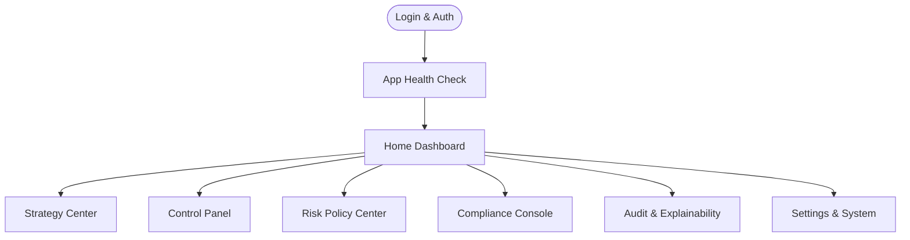
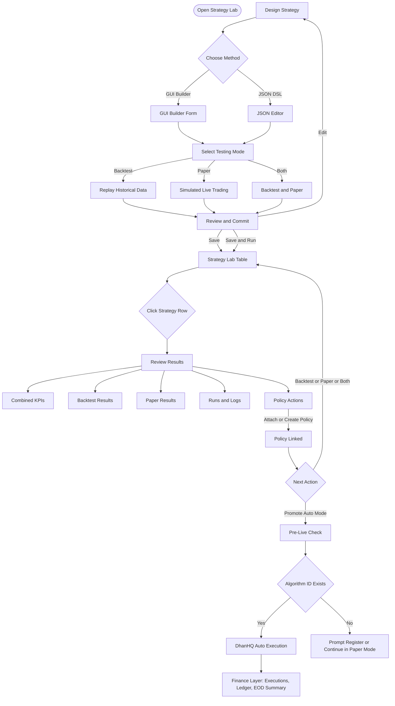
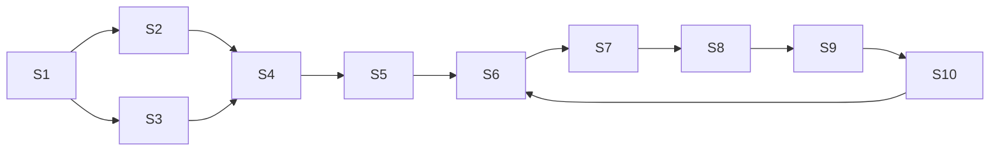

# ⚡ Teevra18 — Strategy Center: UI/UX, User Journeys & Flows

**Teevra18’s Strategy Center UI/UX**, user journeys, and workflows.

---

# ⚡ **Teevra18 — Strategy Center: UI/UX, User Journeys & Flows**

---

## 🧭 Overview

Teevra18 (T18) is an **enterprise-grade, SEBI-compliant, auto-trading ecosystem** for NIFTY, BANK-NIFTY, and NIFTY-50 equities & derivatives.

This document focuses on the **Strategy Center** — where users **design, test, and execute** trading strategies with full compliance visibility.

---

## 🎯 Objectives of the Strategy Center

- **Local-first, GUI-driven** experience.
- Seamless transition from **strategy design → backtesting → live execution**.
- **Optional SEBI registration** — required only for live, automated strategies.
- Built-in **risk policy enforcement** and **explainable decisions**.
- Centralized **audit, versioning, and governance** via `/logs` and `/docs`.

---

## 👥 User Personas

| Role | Key Actions | Needs |
| --- | --- | --- |
| **Trader** | Runs live/paper sessions, monitors KPIs | Fast visibility & control |
| **Strategy Developer** | Designs logic via GUI/JSON | Quick testing & iteration |
| **Compliance Reviewer** | Reviews audit trails | Traceability & SEBI mapping |

---

## 🔄 **High-Level Flow (Summary)**

---

## 🧩 **Detailed User Journey — Strategy Center**

### 1️⃣ Login & Authentication

- **Actions:** Enter credentials → TOTP verification → Static-IP check.
- **Outcome:** Secure entry; ensures compliance with SEBI’s two-factor + static IP rule.

---

### 2️⃣ App Health Check

- Static IP ✅
- DhanHQ Connectivity ✅
- SQLite Audit DB ✅
- Time Sync (IST) ✅

---

### 3️⃣ Strategy Center Overview

Main modules within the Strategy Lab:

| Module | Description |
| --- | --- |
| **GUI Builder** | Visual, block-based strategy design |
| **JSON DSL Editor** | Code-based design with schema validation |
| **Testing Mode Selector** | Choose Backtest, Paper, or Both |
| **Policy Center** | Attach or create risk templates |
| **Results Review** | Analyze KPIs, logs, explainability |
| **Promote to Live** | Deploy if SEBI registration available |

---

## 🧠 **Refined Strategy Flow (with Optional Registration)**

---

| Screen | Title | Key Actions | Transition |
| --- | --- | --- | --- |
| **S1** | Strategy Method Choice | Select GUI / JSON method | → S2 or S3 |
| **S2** | Design via GUI | Create strategy blocks | → S4 |
| **S3** | Design via JSON | Edit DSL JSON | → S4 |
| **S4** | Choose Testing Mode | Backtest / Paper / Both | → S5 |
| **S5** | Review & Commit | Edit, Save, or Run | → S6 |
| **S6** | Strategy Lab Table | Manage strategies | → S7 |
| **S7** | Review Results | Charts, Logs, KPIs | → S8 |
| **S8** | Policy Action | Attach/Create policy | → S9 |
| **S9** | Next Action Choice | Promote or Retest | → S10 |
| **S10** | Live Monitor | Auto execution & finance | → EOD Logs |

---

### 🪄 **Visual Loopback Summary**

---

## 📊 **Live Execution & Finance Layer (S10)**

| Section | Description |
| --- | --- |
| **Market Feed** | Live price stream from DhanHQ |
| **Positions Table** | Real-time P/L and open trades |
| **Risk Alerts** | Visual cues for drawdown/throttle |
| **Ledger** | Executions + Fees + Realized/Unrealized |
| **EOD Summary** | Auto-exported audit & P/L report |

---

## ⚙️ **Compliance Integration**

| Feature | Implementation |
| --- | --- |
| Algorithm ID Enforcement | Checked before Auto Mode |
| Risk Policy Binding | Mandatory before execution |
| Audit Trail | 5-year SQLite log retention |
| OPS Monitoring | Throttles orders/sec |
| SEBI Docs | `/docs/strategy_registration/` |

---

## 🧾 **End-of-Day (EOD) Workflow**

1. Auto-export logs to `/logs/YYYY-MM-DD/`
2. Summaries displayed on Dashboard
3. User can manually back up to Notion or GitHub
4. Audit signatures stored in SQLite hash chain

---

## 🧱 **UI Design Principles**

| Principle | Description |
| --- | --- |
| **Windows-native** | PySide6 interface compiled with PyInstaller |
| **Dark & Light Modes** | User toggle preference |
| **Progressive Disclosure** | Registration and policy visible only when relevant |
| **Explainability** | Panel showing logic reason for each trade |
| **Consistency** | All flows return to Strategy Lab Table hub (S6) |

---

## 📘 **Storyboard (Excalidraw-Style Summary)**

**Narrative:**

Each screen is a frame in the user’s workflow, visually linked through clear transitions and compliance logic.

The Strategy Lab Table (`S6`) is the hub — all runs, policies, and live trades loop through it.

---

## 🔮 **Next Steps**

1. Translate storyboard → **Figma / PySide6 wireframe.**
2. Define **UI tokens** (color palette, typography, spacing).
3. Implement navigation shell (TopBar, SecondaryBar, ContentArea, Footer).
4. Map these flows to **actual Python modules** in `C:\\T18\\app\\ui\\pages\\StrategyLab\\`.

---

## 🧩 **References**

- *TEEVRA18 Project Guide and Documentation.pdf*
- SEBI Circular INVG67858 (Algorithmic Trading Compliance)
- DhanHQ API Documentation

---

**Author:** Neelkanth Dwibedi

**Version:** UI/UX Brainstorm v1.0

**Date:** 05 October 2025

**Scope:** Strategy Center — Design → Test → Execution Flow

---