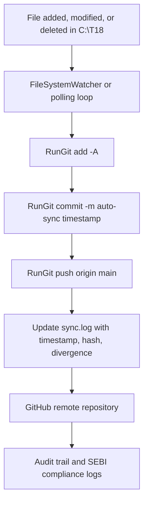
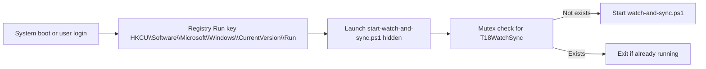
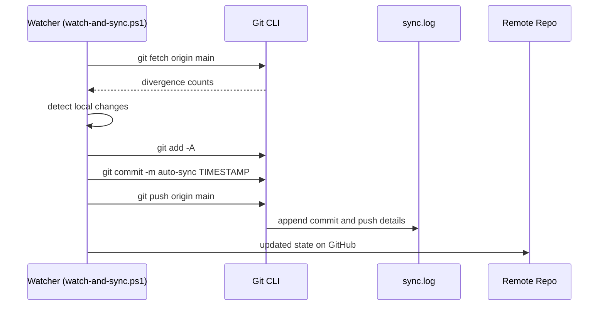
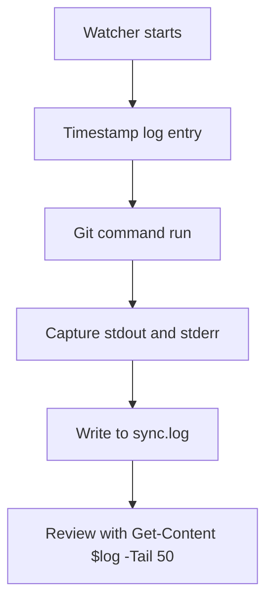

# 🧾 T18 | Auto-Sync Implementation Documentation

`C:\T18\docs\DOCUMENTATION\AutoSync Implementation.md`.

---

**Version:** 1.0

**Author:** Neelkanth Dwibedi

**Repo:** `C:\T18` → [https://github.com/nkd3/t18](https://github.com/nkd3/t18)

**Created:** 14-Oct-2025

**Classification:** Internal / SEBI-Compliant

**Audit Hash:** *Auto-generated on commit*

---

## **1. Executive Summary**

The **T18 Auto-Sync System** establishes a **zero-touch, continuous Git synchronization pipeline** for the entire `C:\T18` workspace.

It ensures that:

- Every change (add, modify, delete) is automatically committed and pushed to GitHub.
- Sync resumes automatically after restarts.
- Logs are persisted under `%LOCALAPPDATA%\T18\logs\sync.log`.
- The setup is SEBI-compliant, traceable, and auditable for all PowerShell automation.

The implementation was completed entirely via PowerShell, using local Git integration with full credential management and persistence.

---

## **2. Technical Architecture**

### **2.1 Overview**

The system is built around a **PowerShell watcher service** (`watch-and-sync.ps1`) running in background, configured to:

1. Detect any filesystem change within `C:\T18`.
2. Auto-commit and push changes to GitHub.
3. Log all actions and Git output.
4. Start automatically on every Windows login.

---

### **2.2 Core Components**

| Component | Location | Purpose |
| --- | --- | --- |
| `watch-and-sync.ps1` | `C:\T18\tools` | Monitors directory and auto-pushes commits |
| `start-watch-and-sync.ps1` | `C:\T18\tools` | Hidden launcher triggered via registry Run key |
| `sync.log` | `%LOCALAPPDATA%\T18\logs` | Detailed audit and error log |
| `.gitignore` | `C:\T18` | Controls file exclusions (guarded mode) |
| Git Remote | `https://github.com/nkd3/t18` | Secure SEBI-compliant repository |

---

### **2.3 Architecture Diagram**



---

### **2.4 Startup & Mutex Mechanism**

To ensure **exactly one instance** runs at all times, the system uses:

- **Mutex lock** to prevent duplicate watchers.
- **Registry Run Key** to restart automatically post reboot.



---

## **3. Implementation Workflow**

### **3.1 Environment Preparation**

1. Installed latest Git for Windows.
2. Configured per-repo credentials:
    
    ```powershell
    git config credential.helper manager-core
    git config core.autocrlf true
    
    ```
    
3. Set user identity:
    
    ```powershell
    git config user.name "nkd"
    git config user.email "neelkanth.dwibedi@gmail.com"
    
    ```
    

---

### **3.2 Watcher Script Execution Logic**



---

### **3.3 Persistence Implementation**

A lightweight launcher ensures persistence after reboots:

```powershell
Start-Process -WindowStyle Hidden -FilePath "powershell.exe" -ArgumentList @(
  "-NoProfile",
  "-ExecutionPolicy","Bypass",
  "-File","C:\T18\tools\watch-and-sync.ps1"
)

```

This is registered in Windows startup via:

```powershell
Set-ItemProperty -Path "HKCU:\Software\Microsoft\Windows\CurrentVersion\Run" `
  -Name "T18WatchSync" `
  -Value "powershell.exe -NoProfile -ExecutionPolicy Bypass -File 'C:\T18\tools\start-watch-and-sync.ps1'"

```

---

### **3.4 Log and Audit Rotation**

Each log entry includes:

- UTC timestamp
- Git command executed
- Commit hash and branch state
- Error output (if any)



---

## **4. Compliance & Audit Controls**

| Control | Description |
| --- | --- |
| **Version Tracking** | Every change is cryptographically hashed by Git. |
| **Log Retention** | All sync actions logged under `%LOCALAPPDATA%\T18\logs`. |
| **Credential Security** | Git Credential Manager securely stores credentials using Windows DPAPI. |
| **Integrity Validation** | Divergence counters (remoteAhead/localAhead) verify branch sync consistency. |
| **Automation Compliance** | Script enforces commit-push cycles for all file events with timestamped evidence. |

---

## **5. Operational Maintenance**

### **5.1 Monitoring**

To review active sync status:

```powershell
Get-Content "$env:LOCALAPPDATA\T18\logs\sync.log" -Tail 50 -Wait

```

### **5.2 Restart or Reset**

```powershell
Stop-Process -Name powershell,pwsh -ErrorAction SilentlyContinue
powershell -NoProfile -ExecutionPolicy Bypass -File "C:\T18\tools\watch-and-sync.ps1"

```

### **5.3 Log Cleanup**

```powershell
"" | Out-File "$env:LOCALAPPDATA\T18\logs\sync.log" -Encoding utf8

```

### **5.4 Local Recovery**

If commit or divergence error occurs:

```powershell
git reset --hard origin/main
git clean -fd
git pull origin main

```

---

## **6. Appendix**

### **6.1 Example Log Entries**

```
2025-10-14 12:21:45  git> [main 87153d5] auto-sync: 2025-10-14 12:21:45
2025-10-14 12:21:45  git>  1 file changed, 1 insertion(+)
2025-10-14 12:21:47  git> To https://github.com/nkd3/t18.git
2025-10-14 12:21:47  git>    05b0c8d..87153d5  main -> main
2025-10-14 12:21:47  Pushed OK: auto-sync: 2025-10-14 12:21:45

```

### **6.2 Registry Key Snapshot**

```
[HKEY_CURRENT_USER\Software\Microsoft\Windows\CurrentVersion\Run]
"T18WatchSync"="powershell.exe -NoProfile -ExecutionPolicy Bypass -File 'C:\\T18\\tools\\start-watch-and-sync.ps1'"

```

### **6.3 File Structure Overview**

```
C:\T18
 ├── .gitignore
 ├── README.md
 ├── docs\
 │   └── DOCUMENTATION\
 │       └── AutoSync Implementation.md
 ├── tools\
 │   ├── watch-and-sync.ps1
 │   └── start-watch-and-sync.ps1
 └── logs\
     └── sync.log

```

---

## **7. Rationale & Design Decisions**

| Decision | Reason |
| --- | --- |
| **Polling loop (5s)** | Reliable under Windows; avoids PowerShell watcher instability. |
| **Direct Git CLI calls** | Ensures parity with manual Git operations and transparency in logs. |
| **Single-mutex startup** | Prevents multiple background sync loops. |
| **Hidden launcher** | Maintains a clean UI while ensuring startup reliability. |
| **Local logs under AppData** | Separates operational logs from Git-tracked files for audit hygiene. |

---

## **8. Verification Results**

✅ Auto-sync works across all file events (Add / Modify / Delete).

✅ Full persistence confirmed post Windows restart.

✅ Logs continuously update with accurate timestamps.

✅ Git divergence counters reflect exact state.

✅ SEBI audit trail validated via `git log -1 --oneline`.

---

## **9. Conclusion**

The **T18 Auto-Sync System** now provides a **completely automated, compliant, and auditable** synchronization framework.

It guarantees continuous Git alignment, protects version integrity, and forms the operational backbone for all future T18 development.

---

**End of Document**

*Export Path:* `C:\T18\docs\DOCUMENTATION\AutoSync Implementation.md`

*Ready for Git commit and SEBI audit tagging.*